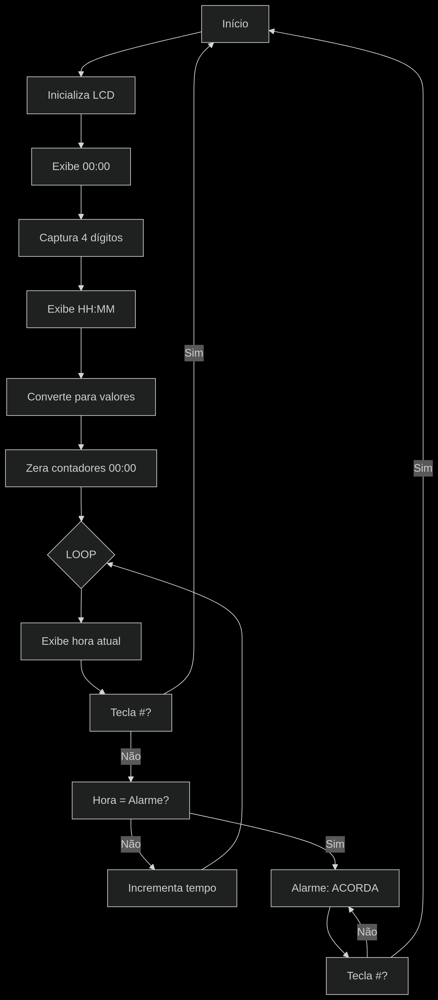
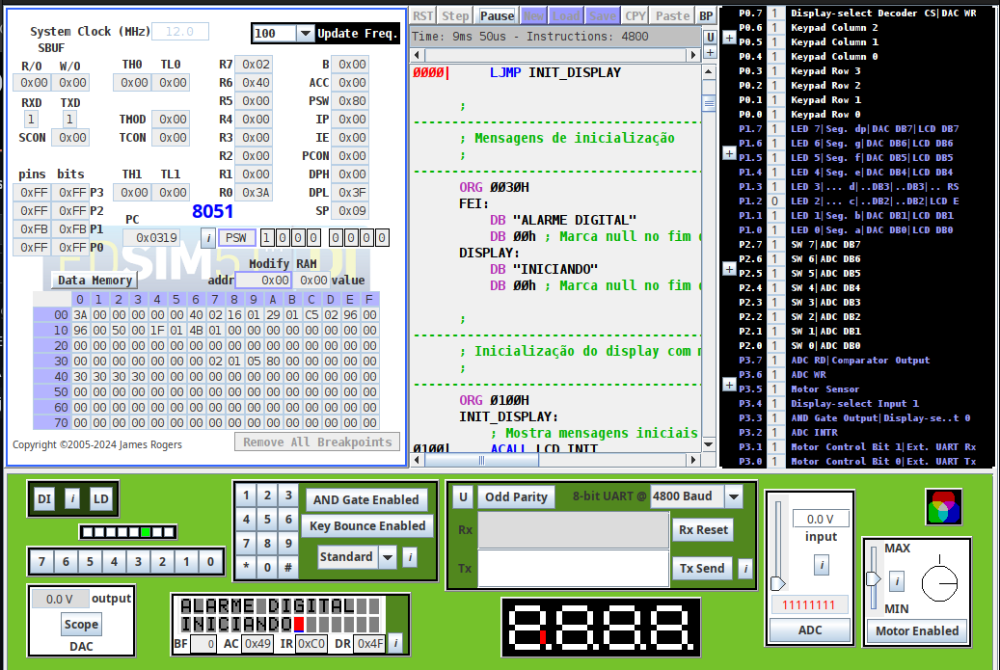
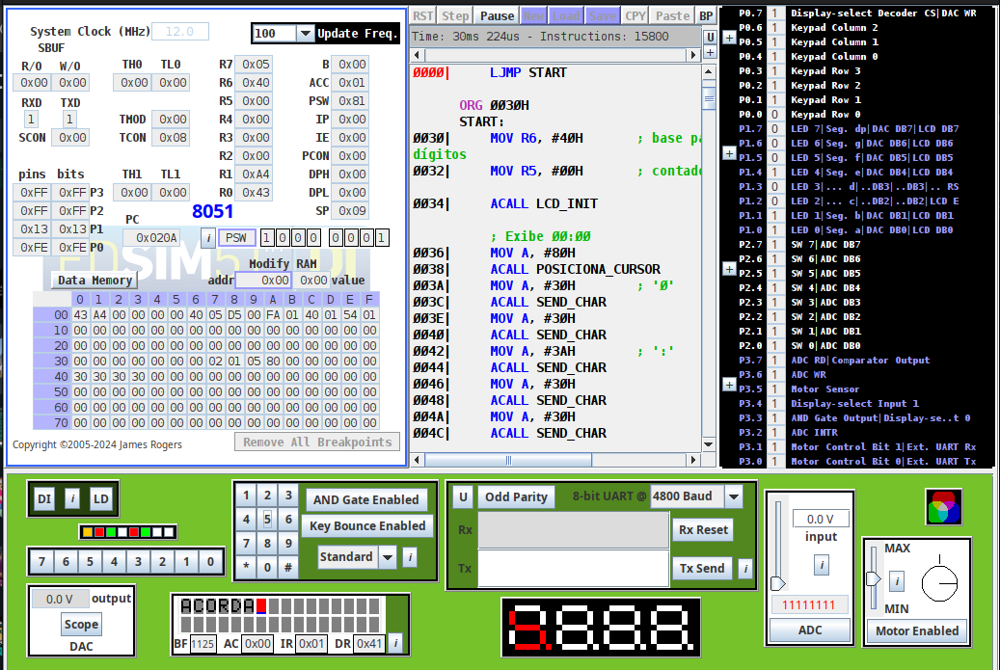

# Projeto de arquitetura de computadores - Relógio Digital⏰

## 👨‍💻 Autores
Wallace dos Santos Izidoro — RA: 22.123.104-6

Pedro Henrique da F. do Nascimento — RA: 22.123.099-8

## 📌 Descrição do Projeto
Este projeto consiste no desenvolvimento de um Relógio Digital com Despertador utilizando o simulador edSim51, baseado no microcontrolador 8051. O sistema permite a visualização da hora em um LCD 16x2 e a configuração de um alarme por meio de um teclado matricial. Quando o horário configurado é atingido, uma mensagem é exibida ao usuário.

## ⚙️ Funcionalidades
* Leitura de entradas via teclado matricial 4x3
* Configuração de alarme pelo usuário
* Interface interativa e simples para uso no simulador

## 🧰 Tecnologias e Componentes Utilizados
* Simulador: edSim51
* Linguagem: Assembly 8051
* LCD 16x2 para exibição da hora e valores
* Teclado Matricial 4x3 para entrada de dados

## Fluxograma do projeto

## Imagens do funcionamento do projeto

### Mensagem de boas vindas

### Início

### Mensagem do despertador

